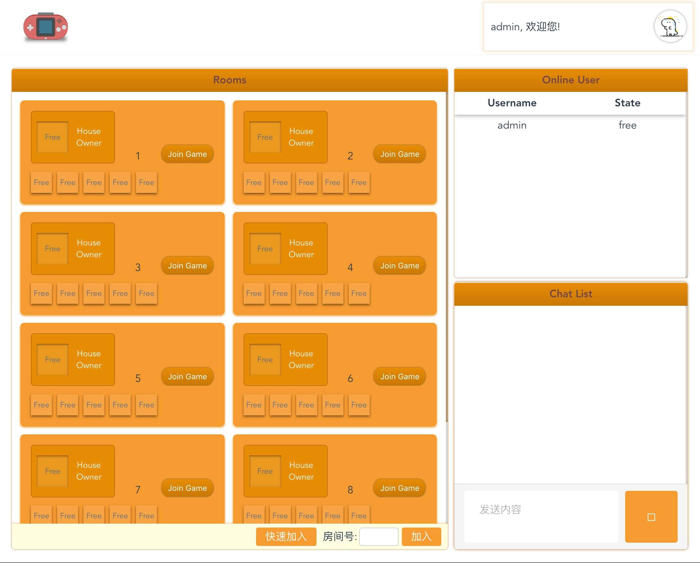
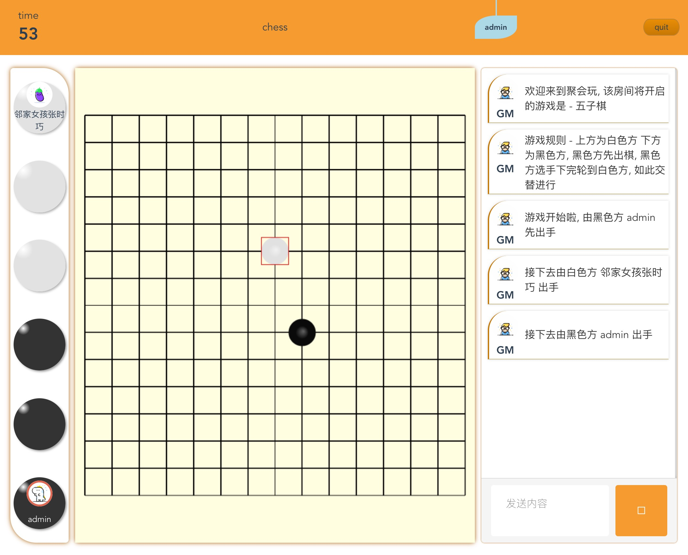

## gameSystem
a python and vue gamesystem project for drawguess(你画我猜) and gobang(五子棋)

## Installation
- install redis 
- install mysql
- install python module
    - tornado 
    - torndb (dependency MySQLdb)
    - redis 
- install npm 

## Usage

- 1. `cd game_vue` and use `npm run dev` to start vue project
- 2. create mysql database and named partyplay, next import sql.sql to partyplay;
- 3. start redis server and `cd game_server` and use `python server` to start server

## screenshot

